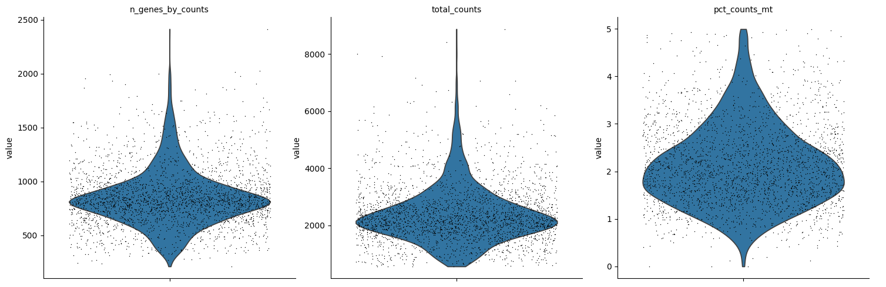
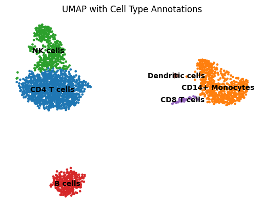
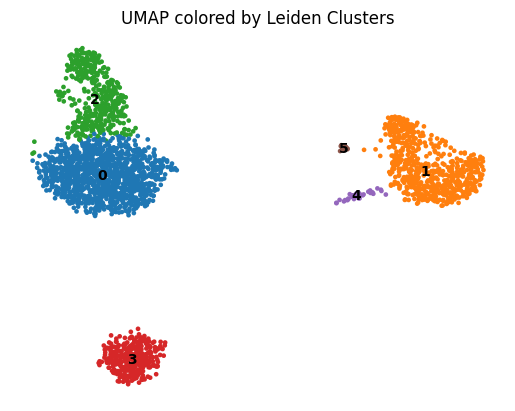
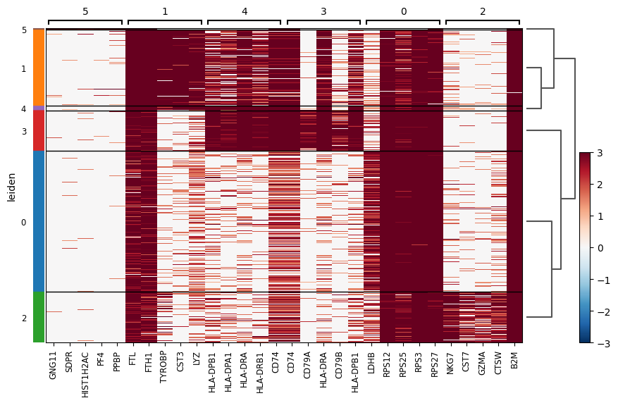

# 🔬 Single-Cell RNA-Seq Analysis of PBMCs using Scanpy


## 📌 Overview
A complete end-to-end single-cell RNA sequencing (scRNA-seq) analysis pipeline applied to **~2,700 Peripheral Blood Mononuclear Cells (PBMCs)** from a healthy donor. This project demonstrates the full bioinformatics workflow — from raw count matrix loading to cell type annotation — using Python's Scanpy ecosystem with interactive Plotly visualizations.

---

## 📊 Dataset
| Property | Details |
|---|---|
| Source | 10x Genomics |
| Cells | ~2,700 PBMCs |
| Genes | 32,738 |
| Sequencing Platform | Illumina NextSeq 500 |
| Reads per Cell | ~69,000 |
| Genome Reference | hg19 (Human) |

> Dataset: [3k PBMCs from a Healthy Donor — 10x Genomics](https://www.10xgenomics.com/datasets/3-k-pbm-cs-from-a-healthy-donor-1-standard-1-1-0)

---

## 🧬 Analysis Pipeline

Raw Count Matrix
↓
Quality Control (violin plots + interactive scatter)
↓
Cell Filtering (n_genes < 2500, pct_mt < 5%)
↓
Normalization + Log Transformation
↓
Highly Variable Gene Selection (2,000 genes)
↓
PCA (50 components) + Interactive 3D PCA
↓
Neighbor Graph + UMAP Embedding
↓
Leiden Clustering (resolution = 0.5)
↓
Cell Type Annotation + Marker Gene Analysis
↓
Interactive Visualizations (Plotly)

---

## 🦠 Cell Types Identified

| Cluster | Cell Type | Key Markers | Cell Count |
|---|---|---|---|
| 0 | CD4 T cells | LDHB, RPS12 | 1,183 |
| 1 | CD14+ Monocytes | FTL, FTH1 | 639 |
| 2 | NK cells | NKG7, GZMA | 426 |
| 3 | B cells | CD74, HLA-DRA | 341 |
| 4 | CD8 T cells | CD79A, CD74 | 37 |
| 5 | Dendritic cells | GNG11, PPBP | 12 |

---
## 🖼️ Results

### QC Metrics


### UMAP with Cell Type Annotations


### UMAP with Leiden Clusters


### Marker Gene Heatmap


---
## 📈 Key Visualizations
- ✅ QC Violin Plots (genes, counts, mitochondrial %)
- ✅ Interactive QC Scatter (library size vs gene complexity)
- ✅ Highly Variable Genes Plot (static + interactive)
- ✅ PCA Elbow Plot + Interactive 3D PCA
- ✅ UMAP colored by Leiden clusters
- ✅ UMAP with cell type annotations
- ✅ Marker gene heatmap
- ✅ Interactive expression box plots per cell type

---

## 🛠️ Requirements

```bash
pip install scanpy leidenalg plotly pandas numpy scipy matplotlib seaborn
```

| Package | Version |
|---|---|
| scanpy | 1.12.1 |
| plotly | latest |
| leidenalg | 0.11.0 |
| pandas | latest |
| numpy | latest |
| scipy | latest |

---

## 🚀 How to Run

1. **Clone the repository**
```bash
git clone https://github.com/yourusername/pbmc-scrna-analysis.git
cd pbmc-scrna-analysis
```

2. **Install dependencies**
```bash
pip install scanpy leidenalg plotly pandas numpy scipy matplotlib seaborn
```

3. **Download the dataset**
   - Go to [10x Genomics PBMC 3k](https://www.10xgenomics.com/datasets/3-k-pbm-cs-from-a-healthy-donor-1-standard-1-1-0)
   - Download **Gene / cell matrix (filtered)**
   - Unzip into `./filtered_gene_bc_matrices/hg19/`

4. **Launch JupyterLab**
```bash
jupyter lab
```

5. **Open and run** `Project1.ipynb`

---

## 📁 Project Structure
pbmc-scrna-analysis/
├── Project1.ipynb          # Main analysis notebook
├── Project1.html           # Static HTML export
├── README.md               # Project documentation
└── filtered_gene_bc_matrices/
└── hg19/
├── barcodes.tsv
├── genes.tsv
└── matrix.mtx
---

## 📚 References
- Wolf, F.A., Angerer, P. & Theis, F.J. *SCANPY: large-scale single-cell gene expression data analysis.* Genome Biology (2018)
- 10x Genomics PBMC 3k dataset
- Traag, V.A., Waltman, L. & van Eck, N.J. *From Louvain to Leiden: guaranteeing well-connected communities.* Scientific Reports (2019)

---

